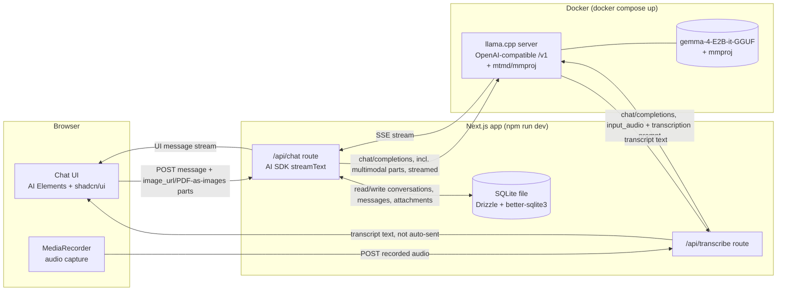
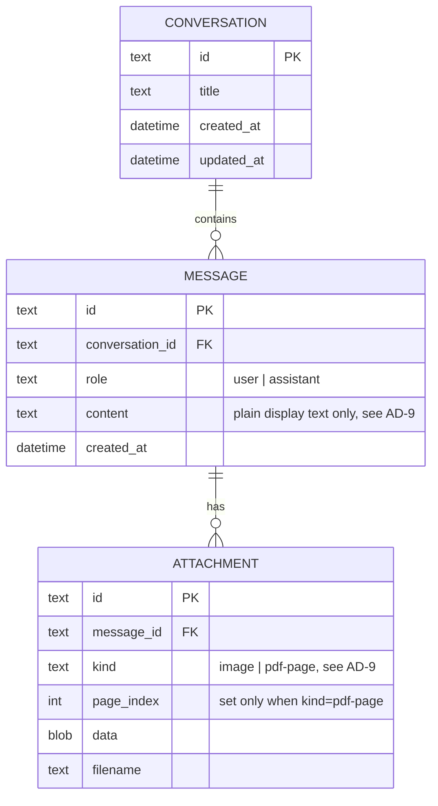

# Architecture Spine: local-gemma-chat

Altitude: whole system (single feature-sized project). Paradigm: **two-process local stack** — an inference container and a thin web app, joined only by an HTTP contract neither owns exclusively. The web app now also owns a local persistence file (SQLite) directly — persistence is a property of the app process, not a third process.

## Diagram

## Invariants (Architecture Decisions)

**AD-1 — Contract between app and model is OpenAI-compatible chat completions, nothing bespoke.**
Binds: the `/api/chat` route talks to the inference layer only through `POST /v1/chat/completions` (or AI SDK's wrapper around it), configured via `baseURL` + dummy `apiKey`.
Prevents: coupling the web app to a llama.cpp-specific or Docker-Model-Runner-specific client library. Swapping the inference container later (different runner, different model) should require changing only the `baseURL`, not app code.

**AD-2 — Inference and app are separate processes with independent lifecycles.**
Binds: the model server runs in Docker (`docker compose up`), the web app runs via `npm run dev`, started and stopped independently.
Prevents: the Next.js app importing or embedding an inference runtime in-process. No node bindings to llama.cpp, no in-process model loading.

**AD-3 — Persistence is a single local SQLite file, owned by the app process. *(supersedes the original "no persistence layer" — history is now in scope, PRD FR-8/FR-9)***
Binds: every conversation, message, and attachment (images, rendered PDF pages) is written to one SQLite file via Drizzle ORM + `better-sqlite3`, accessed directly from the Next.js server process — no new server/service, no Docker volume.
Prevents: a database server process, a second on-disk attachment store, or any persistence mechanism that isn't a single file the app process owns directly. Attachments are stored as BLOBs *inside* that file, not as separate files on disk — single-file purity was chosen over read/write efficiency at this hobby scale.

**AD-4 — No Ollama, no alternate local-model runner.**
Binds: the only supported inference backend is the llama.cpp server container defined in `docker-compose.yml`.
Prevents: introducing Ollama or a second competing local-runner path "just in case" — the whole point of this build is exercising the llama.cpp-direct route.

**AD-5 — Errors surface, they are not engineered around.**
Binds: if the local model server is unreachable, the chat UI shows a plain error/status state (FR-4).
Prevents: adding retry/backoff/circuit-breaker logic — deferred, see below.

**AD-6 — Image input rides the same model/container as text chat; audio does the same only if it proves reliable at build time.**
Binds: images (FR-6) are sent as `image_url` content parts on the *existing* `/v1/chat/completions` contract (AD-1), via llama.cpp's `mtmd`/`mmproj` support — confirmed solid: the running `ggml-org/gemma-4-E2B-it-GGUF` model ships a matching `mmproj-gemma-4-E2B-it-*.gguf`, auto-fetched by the `-hf` flag, vision-only mtmd is mature in llama.cpp. Audio (FR-7's `input_audio` path) is the *same mechanism in principle* but is a recent, actively-changing area of llama.cpp as of this writing — multiple open/recently-fixed GitHub issues on Gemma-4 audio input (routing gaps, assert errors, a regression) mean it must be smoke-tested against the running container before AD-8 is implemented as written, not assumed from this spine.
Prevents: introducing a second vision model/container for images (settled, low risk). Prevents *assuming* audio input works without verifying it end-to-end first (the risk AD-8 carries forward).

**AD-7 — PDF attachments are rendered to page images, never OCR'd or text-extracted; only rendered pages persist.**
Binds: FR-6's PDF path converts pages to images (mechanism — e.g. `pdf.js` / a `pdf-to-img`-class library — decided at implementation time) before sending them as `image_url` parts, identical to a native image attachment. Only the rendered page images are persisted (AD-3's `ATTACHMENT` rows); the original PDF bytes are not kept.
Prevents: a parallel text-extraction/OCR code path that would diverge from how image attachments are handled. Prevents storing both the source PDF and its rendered pages, which would double storage and create an ambiguous source of truth. Only a bounded number of leading pages are rendered per attachment (exact cap: open question below).

**AD-8 — Voice-to-text is a dedicated transcribe-then-review step, not inline dictation; falls back to a second local model if native audio input isn't reliable.**
Binds: `/api/transcribe` is a separate route from `/api/chat`, and is **ephemeral** — it writes nothing to SQLite; no `CONVERSATION`, `MESSAGE`, or `ATTACHMENT` row is created for the raw recording, and the audio itself is never persisted. The browser's `MediaRecorder` captures one bounded, non-streaming recording; the route sends it as `input_audio` to the llama.cpp container with a transcription-focused prompt; the returned text populates the message input box for the user to edit/send. Only once the user sends it does it become an ordinary `MESSAGE` row via `/api/chat`'s existing path (AD-3) — there is exactly one path that creates messages.
Prevents: building live/streaming transcription; folding transcription into `/api/chat`'s streaming contract; two competing code paths that both know how to create a `MESSAGE` row.
Fallback (only if AD-6's audio smoke test fails): swap `/api/transcribe`'s target to a dedicated local STT container (e.g. a whisper.cpp-class image) added to `docker-compose.yml` as a second service. This is the one sanctioned exception to AD-4's one-model rule — log it as a new `AD` at build time if triggered, don't silently add it.

**AD-9 — `MESSAGE.content` is always plain display text; attachments are never inlined into it.**
Binds: `MESSAGE.content` holds only the human-readable text of that turn (a user's typed/dictated words, or the assistant's reply text) — never a JSON-serialized parts array, never inlined attachment data. Every attachment a message carries is a separate `ATTACHMENT` row with `message_id` pointing back to it; the full multimodal request sent to the model is *reconstructed* at request time by joining a message's `content` with its `ATTACHMENT` rows, never stored pre-assembled. `ATTACHMENT.kind` is one of exactly `'image'` (a native JPEG/PNG) or `'pdf-page'` (one row per rendered PDF page, with a `page_index` column); a PDF attachment becomes N `'pdf-page'` rows, never one multi-image blob. `MESSAGE.role` is one of exactly `'user'` or `'assistant'`.
Prevents: two divergent storage shapes for the same conceptual data (caption-only vs. JSON-serialized-parts-with-duplicated-blobs); an unconstrained `kind`/`role` vocabulary that different code paths could tag inconsistently; ambiguity over whether a PDF's pages are one row or many.

## Consistency Conventions

| Concern | Convention |
| --- | --- |
| Primary keys | `nanoid()` (already a project dependency) for every `text id` — no auto-increment integers, no UUIDs. |
| SQLite-touching routes | `app/api/chat/route.ts` and `app/api/transcribe/route.ts` must set `export const runtime = "nodejs"` — `better-sqlite3` needs Node native bindings and will not run on the Edge runtime. |
| DB migrations | Drizzle migrations live in `db/migrations/`; applied automatically on app startup (e.g. checked/run lazily on first DB access from `lib/db.ts`), not a manual step — preserves the PRD's two-command (`docker compose up` + `npm run dev`) startup goal. |
| `MESSAGE.role` | Exactly `'user'` \| `'assistant'` (AD-9). |
| `ATTACHMENT.kind` | Exactly `'image'` \| `'pdf-page'` (AD-9). |

## Seed (true at cold start, owned by code thereafter)

- **Stack:** Next.js (App Router) + TypeScript, Vercel AI SDK (`ai`, `@ai-sdk/openai-compatible`), AI Elements, shadcn/ui, Tailwind — all already in `package.json`. New: Drizzle ORM + `better-sqlite3`.
- **Inference image:** `ghcr.io/ggml-org/llama.cpp:server`, launched with `-hf ggml-org/gemma-4-E2B-it-GGUF` (this is what `docker-compose.yml` already runs — verified this repo exists on Hugging Face and ships `mmproj-gemma-4-E2B-it-{bf16,Q8_0}.gguf`, auto-fetched by `-hf`), `--port 8080`, `--host 0.0.0.0`, `-c 8192`.
- **Compose file location:** repo root, `docker-compose.yml` (exists). Single service: `llama-server`.
- **App location:** repo root. Existing routes: `app/api/chat/route.ts` (text + multimodal chat, AD-1/AD-6), `app/api/status/route.ts` (FR-4 server-reachability check). New routes: `app/api/transcribe/route.ts` (voice-to-text, AD-8), `app/api/conversations/route.ts` + `app/api/conversations/[id]/route.ts` (FR-9: list, resume, delete — `GET` lists, `DELETE :id` removes; opening `app/page.tsx` loads the most recent conversation by default per FR-9). Chat page at `app/page.tsx`.
- **Persistence:** SQLite file at a fixed local path (e.g. `data/local-gemma-chat.db`, gitignored), Drizzle schema in `db/schema.ts`, migrations in `db/migrations/`.
- **Config surface:** model base URL is an env var (`LOCAL_MODEL_BASE_URL`, default `http://localhost:8080/v1`) so the port/host can move without a code change.

### Entities

## Deferred

- GPU acceleration / performance tuning of the llama.cpp container — out of scope; CPU inference is accepted per the PRD's non-functional requirements.
- Retry/reconnect logic for a dropped model server — deferred per AD-5; revisit if this stops being a toy.
- Swapping in a different GGUF model or multi-model selection UI — architecture supports it via `baseURL`/model-name config, but no UI for it is being built now.
- Exact page cap for rendered PDF attachments (AD-7) and exact max recording length for voice-to-text (AD-8) — bounded by llama.cpp `mtmd`'s ~30s audio chunking and practical request payload size, but no concrete number chosen yet; decide at implementation time.
- SQLite file growth/vacuuming as attachment BLOBs accumulate — not addressed; acceptable at hobby scale, revisit if the DB file becomes unwieldy.
- Multi-page PDF rendering mechanism (exact library: `pdf.js` vs. a `pdf-to-img`-class package) — named as a dependency in AD-7 but not pinned.
- `[OPEN QUESTION]` `[BUILD-BLOCKING for FR-7]` Does `input_audio` actually work end-to-end against the running `ggml-org/gemma-4-E2B-it-GGUF` + llama.cpp server container? Web research found this to be an active, recently-buggy area of llama.cpp (routing gaps, assert errors, a reported regression, all within roughly the last month). AD-6/AD-8 name the fallback (a second local STT container) but do NOT pre-select it — smoke-test audio input first; only add the fallback service if it fails.

## Operational Envelope

- **Environments:** local development only. No staging/production deploy target.
- **Deployment:** `docker compose up` (inference) + `npm run dev` (app). No CI/CD, no container registry push. The SQLite file persists on the host filesystem across both.
- **Provider strategy:** none — no cloud dependency by design (AD-4, AD-6, FR-5).
