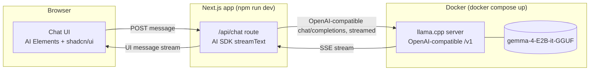

# Architecture Spine: local-gemma-chat

Altitude: whole system (single feature-sized project). Paradigm: **two-process local stack** — an inference container and a thin web app, joined only by an HTTP contract neither owns exclusively.

## Diagram

## Invariants (Architecture Decisions)

**AD-1 — Contract between app and model is OpenAI-compatible chat completions, nothing bespoke.**
Binds: the `/api/chat` route talks to the inference layer only through `POST /v1/chat/completions` (or AI SDK's wrapper around it), configured via `baseURL` + dummy `apiKey`.
Prevents: coupling the web app to a llama.cpp-specific or Docker-Model-Runner-specific client library. Swapping the inference container later (different runner, different model) should require changing only the `baseURL`, not app code.

**AD-2 — Inference and app are separate processes with independent lifecycles.**
Binds: the model server runs in Docker (`docker compose up`), the web app runs via `npm run dev`, started and stopped independently.
Prevents: the Next.js app importing or embedding an inference runtime in-process. No node bindings to llama.cpp, no in-process model loading.

**AD-3 — No persistence layer.**
Binds: conversation state lives only in React state / the AI SDK's in-memory message list for the life of the browser tab.
Prevents: adding a database, file-based history, or server-side session store. If a future need for history arises, it's a new decision, not a silent addition here.

**AD-4 — No Ollama, no alternate local-model runner.**
Binds: the only supported inference backend is the llama.cpp server container defined in `docker-compose.yml`.
Prevents: introducing Ollama or a second competing local-runner path "just in case" — the whole point of this build is exercising the llama.cpp-direct route.

**AD-5 — Errors surface, they are not engineered around.**
Binds: if the local model server is unreachable, the chat UI shows a plain error/status state (FR-4).
Prevents: adding retry/backoff/circuit-breaker logic — deferred, see below.

## Seed (true at cold start, owned by code thereafter)

- **Stack:** Next.js (App Router) + TypeScript, Vercel AI SDK (`ai`, `@ai-sdk/openai-compatible` or `@ai-sdk/openai` pointed at a custom `baseURL`), AI Elements (`npx ai-elements@latest add`), shadcn/ui, Tailwind.
- **Inference image:** `ghcr.io/ggml-org/llama.cpp:server`, launched with `-hf ggml-org/gemma-4-E2B-it-GGUF` (or the closest published Gemma-4-E2B GGUF repo — verified at build time since exact HF repo naming can shift), `--port 8080`, `--host 0.0.0.0`.
- **Compose file location:** repo root, `docker-compose.yml`. Single service: `llama-server`.
- **App location:** repo root (Next.js app is the repo itself, not nested), API route at `app/api/chat/route.ts`, chat page at `app/page.tsx`.
- **Config surface:** model base URL is an env var (`LOCAL_MODEL_BASE_URL`, default `http://localhost:8080/v1`) so the port/host can move without a code change.

## Deferred

- GPU acceleration / performance tuning of the llama.cpp container — out of scope; CPU inference is accepted per the PRD's non-functional requirements.
- Retry/reconnect logic for a dropped model server — deferred per AD-5; revisit if this stops being a toy.
- Swapping in a different GGUF model or multi-model selection UI — architecture supports it via `baseURL`/model-name config, but no UI for it is being built now.
- Conversation persistence — deferred per AD-3; revisit if a future need for history is explicitly scoped.

## Operational Envelope

- **Environments:** local development only. No staging/production deploy target.
- **Deployment:** `docker compose up` (inference) + `npm run dev` (app). No CI/CD, no container registry push.
- **Provider strategy:** none — no cloud dependency by design (AD-4, FR-5).
